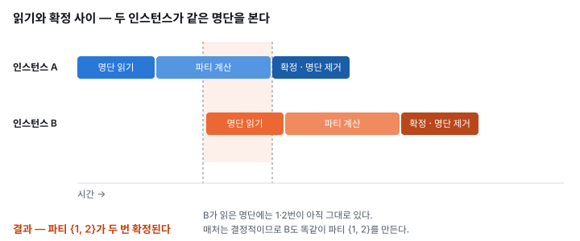
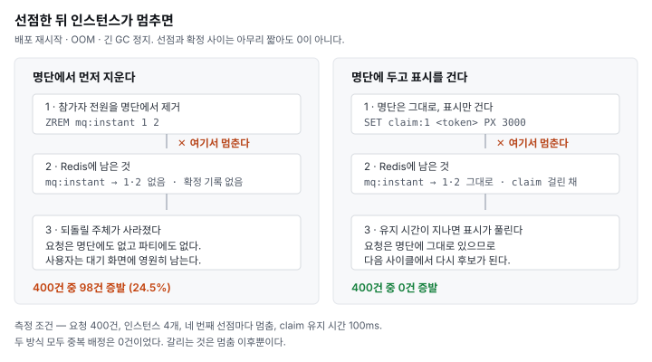

# 같은 사람이 두 파티에 들어가는 문제, 그리고 왜 명단 삭제 대신 claim이었나 (Redis · Lua)

게임 같이 할 사람을 찾아주는 서비스를 만들고 있습니다. 조건을 넣고 기다리면 서버가 맞는 사람들을 묶어 파티를 만들어 주는 기능이 있는데, 이 매칭 루프를 여러 인스턴스가 동시에 돌리면 한 사람이 두 파티에 들어가는 문제가 생깁니다.

이 글은 그 문제를 재현하고, 두 가지 해결책을 부하와 장애 상황에서 각각 재본 뒤 왜 그중 하나를 골랐는지에 대한 기록입니다. 흥미로웠던 건 부하 측정만으로는 둘 중 어느 쪽도 고를 수 없었다는 점입니다.

---

## 매칭 루프가 하는 일

즉시 매칭의 처리 절차는 네 단계입니다.

1. 대기 명단을 읽습니다
2. 요청을 보고 같이 앉힐 인원을 찾습니다
3. 찾은 전원을 선점합니다
4. 확정을 알립니다

대기 명단은 Redis Sorted Set에 있습니다. score를 신청 시각으로 두면 Redis가 정렬을 대신 해 주므로, 매칭 루프는 앞에서부터 읽기만 하면 됩니다.

```java
/** 대기 중인 요청 ID를 전순서대로 읽는다. */
public List<Long> requestIds() {
    Set<String> members = redis.opsForZSet().range(key(), 0, -1);
    return members == null ? List.of() : members.stream().map(Long::valueOf).toList();
}
```

그리고 파티를 만드는 매처는 결정적입니다. 어떤 순서로 요청이 들어오든 `(신청 시각, 요청 ID)`로 정렬해서 시작하므로, 같은 요청 집합에는 항상 같은 파티가 나옵니다. 유사도 점수도, 대기 시간에 따른 조건 완화도 없습니다.

결정성은 테스트에는 축복입니다. 그런데 여기서는 정확히 그것이 문제가 됩니다.

---

## 문제: 읽기와 확정 사이

서버 인스턴스는 여럿이고, 전부 같은 대기 명단을 봅니다. 인스턴스 A가 명단을 읽고 파티를 계산하는 동안 인스턴스 B도 같은 명단을 읽어 갈 수 있습니다.

매처가 결정적이므로 B는 A와 똑같은 파티를 만듭니다. 그리고 둘 다 확정합니다.



한 요청은 최대 하나의 파티에만 들어가야 합니다. 이건 이 시스템의 불변식 중 하나인데, 그게 깨집니다.

### 재현: 틈을 강제로 벌리기

이 틈은 밀리초 단위라 그냥 돌려서는 좀처럼 잡히지 않습니다. 그래서 barrier로 두 인스턴스가 같은 명단을 손에 쥔 순간을 만들어 재현했습니다.

```java
/** 매칭 루프 한 바퀴. */
private List<Party> cycle(CyclicBarrier read) throws Exception {
    // 1·2단계 — 명단을 읽고 요청을 본다.
    List<MatchRequest> snapshot = waiting.requestIds().stream()
            .map(requests::find)
            .flatMap(Optional::stream)
            .toList();
    read.await();   // 두 인스턴스가 같은 명단을 쥔 순간을 만든다

    List<Party> confirmed = new ArrayList<>();
    for (Party party : PartyMatcher.match(snapshot)) {
        List<Long> memberIds = memberIdsOf(party);
        memberIds.forEach(waiting::remove);   // 4단계 — 확정
        confirmed.add(party);
    }
    return confirmed;
}
```

대기 요청 2개를 넣고 인스턴스 2개가 각자 한 바퀴를 돌면, 양쪽 모두 파티를 하나씩 확정합니다. 같은 두 사람으로 만든 서로 다른 파티입니다.

```java
@Test
@DisplayName("claim이 없으면 같은 두 사람이 두 파티에 들어간다")
void withoutClaimTheSameRequestsLandInTwoParties() throws Exception {
    List<List<Party>> confirmed = raceTwoInstances(false);

    assertThat(confirmed.get(0)).hasSize(1);
    assertThat(confirmed.get(1)).hasSize(1);
    assertThat(memberIdsOf(confirmed.get(0).getFirst()))
            .isEqualTo(memberIdsOf(confirmed.get(1).getFirst()));

    // 명단만 보면 멀쩡하다. 같은 것을 두 번 지웠을 뿐이라 흔적이 남지 않는다.
    assertThat(waiting.size()).isZero();
}
```

마지막 줄이 이 문제의 성격을 잘 보여줍니다. 대기 명단은 멀쩡해 보입니다. 같은 요청을 두 번 지웠을 뿐이라 아무 흔적도 남지 않습니다. 명단을 아무리 들여다봐도 이 문제는 찾을 수 없습니다.

---

## 선택지 둘

3단계인 선점을 어떻게 구현하느냐의 문제입니다. 두 가지가 떠올랐습니다.

첫째, 명단에서 먼저 지우는 방법입니다. 지우는 데 성공하면 내가 가져간 것입니다. 명단에 없으면 남이 이미 가져갔다는 뜻이므로 다른 인스턴스가 볼 수 없습니다.

둘째, 명단에 두고 표시를 거는 방법입니다. `claim:{requestId}` 키를 만들고 유지 시간을 줍니다. 명단에는 그대로 있지만 표시가 걸려 있으면 남이 가져갈 수 없습니다.

어느 쪽이든 전원 아니면 아무도여야 합니다. 다섯 명 중 셋만 선점된 상태가 남으면 그 셋은 파티가 되지 못한 채 묶여 있게 됩니다.

### 왜 Lua인가

이게 생각보다 까다롭습니다. Redis에는 롤백이 없기 때문입니다.

`MULTI`는 명령을 묶어 보낼 뿐이라 세 번째에서 실패해도 앞의 둘이 되돌아가지 않습니다. 자바에서 하나씩 `SET NX`를 걸고 실패하면 지우는 방법도 생각할 수 있는데, 그 사이에 다른 인스턴스가 끼어들면 양쪽 다 일부만 쥔 채 서로를 막는 상태가 됩니다.

Redis는 스크립트를 통째로 실행하는 동안 다른 명령을 받지 않습니다. 그래서 검사와 설정을 한 스크립트에 넣으면 그 틈이 사라집니다.

```lua
-- 전부 확인한 뒤에 전부 설정한다.
for i = 1, #KEYS do
  if redis.call('EXISTS', KEYS[i]) == 1 then
    return 0
  end
end
for i = 1, #KEYS do
  redis.call('SET', KEYS[i], ARGV[1], 'PX', ARGV[2])
end
return 1
```

명단에서 지우는 쪽도 같은 구조가 필요합니다. 그런데 여기엔 함정이 하나 더 있습니다. `ZREM`은 여러 멤버를 한 번에 받지만 있는 것만 지우고 지운 개수를 돌려줍니다. 명령 하나로 다섯 중 셋만 지워지는 결과가 나올 수 있고, 그 셋은 파티가 되지 못한 채 명단 밖으로 나갑니다.

```lua
-- ZSCORE로 전부 확인한 뒤에 전부 지운다.
for i = 1, #ARGV do
  if redis.call('ZSCORE', KEYS[1], ARGV[i]) == false then
    return 0
  end
end
for i = 1, #ARGV do
  redis.call('ZREM', KEYS[1], ARGV[i])
end
return 1
```

두 스크립트의 구조가 같습니다. 무엇을 건드리는지만 다릅니다.

### 소유자 토큰

claim 쪽에는 하나가 더 붙습니다. 유지 시간이 먼저 끝나 남이 같은 요청을 잡았을 때, 뒤늦게 도착한 내 해제 요청이 남의 표시를 지우면 안 됩니다. 그래서 표시를 걸 때 무작위 토큰을 값으로 넣고, 해제는 값이 내 토큰일 때만 지웁니다.

```lua
local released = 0
for i = 1, #KEYS do
  if redis.call('GET', KEYS[i]) == ARGV[1] then
    redis.call('DEL', KEYS[i])
    released = released + 1
  end
end
return released
```

---

## 부하에서는 구분이 안 됩니다

두 방식을 실제로 재봤습니다. 요청을 정해진 시각표대로 흘려 넣는 동안 인스턴스 여럿이 각자 매칭 루프를 돌고, 각 인스턴스가 확정한 파티를 모아 한 요청이 두 파티에 들어갔는지 셉니다. 인스턴스 수(2·4·8), 사이클 주기(쉼 없이 · 10ms), 선점 방식(없음 · 삭제 · claim)을 조합했습니다.

먼저 제어가 없을 때입니다. 나와야 할 파티 수 대비 실제로 확정된 파티 수를 보면 이렇습니다.

| 인스턴스 | 확정 파티 배율 | 중복 배정된 요청 |
|---|---|---|
| 2개 | 1.99배 | 99.6% |
| 4개 | 4.00배 | 100% |
| 8개 | 7.99배 | 100% |

배율이 인스턴스 수와 거의 정확히 같습니다. 모든 인스턴스가 매번 같은 명단을 보고 같은 파티를 각자 확정했다는 뜻입니다. 실제 루프처럼 10ms 주기를 두고 인스턴스마다 위상을 어긋나게 띄워도 76.7%(2개)에서 92.9%(8개)로, 크게 나아지지 않았습니다. 한 사이클이 5~6ms나 걸리기 때문에 주기의 절반 이상이 겹칠 수 있는 구간입니다.

그리고 선점을 넣으면 두 방식 모두 0이 됩니다.

아래는 10ms 주기 · 인스턴스 8개 조건입니다.

| 선점 방식 | 중복 배정 | 사이클 p50 | 포기한 파티 | 파티/초 |
|---|---|---|---|---|
| 없음 | 92.9% | 5.75ms | — | (중복 포함이라 무의미) |
| 명단 삭제 | 0% | 4.45ms | 84.3% | 824 |
| claim | 0% | 5.92ms | 86.4% | 823 |

여기서 멈추면 claim을 고를 이유가 없습니다. 오히려 삭제 쪽이 나아 보입니다.

- 사이클이 더 짧습니다 (4.45ms 대 5.92ms)
- 남이 먼저 가져가서 포기하는 파티가 더 적습니다 (84.3% 대 86.4%)
- 코드가 단순합니다. 토큰도 유지 시간도 필요 없습니다

처리량은 양쪽이 사실상 같았고, 이건 유입이 허용하는 최대치(2,500 요청 ÷ 1.5초 ÷ 2인 = 833)에 붙은 값입니다. 즉 이 부하에서는 어느 쪽도 처리량을 깎지 않았습니다.

정상 동작에서 두 방식은 구분되지 않습니다. 이 표만 놓고 보면 더 단순하고 더 빠른 쪽을 고르는 게 맞습니다.

---

## 그런데 인스턴스는 죽습니다

선점과 확정 사이는 아무리 짧아도 0이 아닙니다. 배포로 인한 재시작, OOM, 긴 GC 정지는 버그가 아니라 정상 운영 중에 일어나는 일이고, 충분히 오래 돌리면 언젠가 정확히 이 사이에서 멈춥니다.

멈춘 순간 Redis에 남는 상태가 두 방식에서 완전히 다릅니다.



명단에서 지우는 방식은 되돌릴 주체가 사라집니다. 그 요청들은 명단에도 없고 확정된 파티에도 없습니다. 어디에도 없습니다.

claim 방식은 명단에 그대로 있습니다. 유지 시간이 지나면 표시가 저절로 풀리고, 그 요청들은 다음 사이클에서 다시 후보가 됩니다.

### 재보기

요청 400건을 미리 넣어 두고, 인스턴스 4개가 명단이 빌 때까지 돌립니다. 네 번째 선점마다 인스턴스가 멈춥니다.

실제로 스레드를 죽이지는 않았습니다. 선점 직후 확정을 건너뛰고 다음 사이클로 넘어가면 Redis에 남는 상태가 프로세스가 죽은 것과 같습니다. 죽은 인스턴스가 곧바로 재시작한 것으로 보면 됩니다. 멈추는 시점을 확률이 아니라 몇 번째 선점인지로 고정해 두어 같은 조건에서 같은 횟수가 나오게 했습니다.

세는 것은 증발입니다. 유입됐는데 확정된 파티에도 없고 대기 명단에도 없는 요청입니다. 사용자 입장에서는 신청을 넣었는데 파티도 안 오고 취소도 안 된 채 대기 화면에 영원히 남는 상태입니다. 서버에는 아무 흔적도 남지 않으므로, 저장소를 직접 대조하는 것 말고는 알아낼 방법이 없습니다.

| 선점 방식 | 유입 | 멈춤 | 확정된 요청 | 명단 잔여 | 증발 | 중복 배정 |
|---|---|---|---|---|---|---|
| 명단 삭제 | 400 | 49회 | 302 | 0 | 98건 (24.5%) | 0 |
| claim | 400 | 64회 | 400 | 0 | 0건 | 0 |

98건은 우연한 숫자가 아닙니다. 멈춤 49회 곱하기 2인 파티는 정확히 98명입니다. 멈출 때마다 그 파티의 참가자가 그만큼 사라졌습니다.

그리고 한 가지 더 있습니다. 명단 삭제 쪽이 더 빨리 비었습니다. 다 처리해서가 아니라 잃어버려서입니다. 대기 명단이 비었다는 사실을 성공 신호로 읽으면 안 되는 이유가 여기 있습니다.

---

## claim의 대가

공짜는 아닙니다. claim을 걸면 다른 인스턴스가 이미 잡은 파티를 포기해야 하고, 그만큼 계산이 버려집니다.

쉼 없이 도는 루프에서 claim을 걸었을 때입니다.

| 인스턴스 | 포기한 파티 비율 |
|---|---|
| 2개 | 59.3% |
| 4개 | 79.9% |
| 8개 | 90.8% |

인스턴스 8개면 만든 파티의 열에 아홉을 버립니다. 처리량이 깎이지는 않았지만, 앞서 말했듯 이 측정에서는 유입이 상한이라 그렇게 보이는 것이고, 일한 만큼 파티가 나오지 않는다는 건 분명합니다. 인스턴스를 몇 개까지 늘리는 것이 이득인지는 여기서 갈릴 것 같습니다.

---

## 마치며

정리하면 이렇습니다.

정합성 문제는 정상 동작에서 잘 안 보입니다. 부하 표에서 두 방식은 똑같이 중복 배정 0이었고, 오히려 나중에 탈락한 쪽이 더 빨라 보였습니다. 실패 경로를 따로 재보지 않았다면 더 단순하고 더 빠른 쪽을 골랐을 겁니다.

갈리는 곳은 실패 경로입니다. 그리고 그걸 재려면 실패를 재현해야 합니다. 실제로 프로세스를 죽일 필요는 없었습니다. 저장소에 남는 상태가 같아지는 지점을 찾으면 됩니다.

비었다는 것은 성공이 아닙니다. 명단이 빠르게 비는 쪽이 실은 요청을 잃고 있었습니다.

### 아직 못 잰 것

- 포화 상태의 처리량과 지연입니다. 이번 측정은 유입이 상한이라 claim의 한계가 아니라 유입의 한계를 본 것입니다. 유입을 서버가 못 따라올 때까지 올려야 나옵니다.
- 유지 시간 때문에 놓치는 파티입니다. 지금은 확정된 요청만 표시가 걸려 있어서 드러나지 않습니다.
- 실제 티어·포지션 분포에서의 파티 성립률입니다. 이번엔 조건이 전부 서로 맞는 요청만 썼습니다.

셋 다 HTTP API가 선 다음 k6로 잴 생각입니다.

### 이 숫자의 한계

인스턴스는 한 JVM 안의 스레드입니다. Redis만 실제 프로세스이고 네트워크 지연도, 인스턴스별 GC도, 실제 요청 분포도 없습니다. 그래서 여기서 읽어야 할 것은 절대값이 아니라 같은 조건에서 두 방식이 만드는 차이입니다.

---

<!--
편집 메모 (게시 전 삭제)

제목 후보
  1. 같은 사람이 두 파티에 들어가는 문제, 그리고 왜 명단 삭제 대신 claim이었나 (Redis · Lua)
  2. 부하 테스트로는 고를 수 없었던 선택 — 매칭 동시성 제어 (Redis · Lua)
  3. 대기 명단이 비었다고 다 처리된 게 아닙니다 (Redis · Lua)
  → 2번이 이 글의 핵심 반전에 가장 가깝습니다. 1번은 검색에 유리합니다.

이미지
  - images/timeline.svg, images/crash.svg 를 티스토리에 업로드한 뒤 경로를 바꿔야 합니다.
  - 부하 측정 차트가 더 필요하면 아티팩트 페이지에서 캡처해 쓰면 됩니다.

정확성 메모
  - 재현 테스트 코드는 블로그용으로 줄였습니다. 실제 MatchingRaceTest.cycle()은
    claim 유무를 인자로 받아 한 메서드로 두 경우를 다 돕니다.
  - 코드 블록 안의 주석은 실제 소스 그대로라 평서체입니다. 본문 문체와 다른 것이
    거슬리면 블로그용으로 다듬어도 되지만 저장소와 달라집니다.

보강하면 좋을 것
  - 들어가며 절에 서비스 소개 두세 문장이 필요합니다. 지금은 한 문장뿐이라 맥락이 얇습니다.
  - PartyMatcher가 왜 결정적이어야 하는지 한 문단이 있으면 좋겠습니다.
    결정성이 문제의 원인이자 재현의 근거라 설명 가치가 있습니다.
  - 측정 코드 저장소 링크

측정값 출처
  - measurements/matching-load.csv  (MatchingLoadTest)
  - measurements/matching-crash.csv (MatchingCrashTest)
-->
