# 데이터 모델 — ERD

## 문서 범위

- 이 ERD는 **PostgreSQL만** 다룬다. Redis 자료구조는 포함하지 않는다(5장).
- 각 테이블이 어느 문서에서 나왔는지 표기한다. **도출한 것과 명세에 있던 것을 구분한다.**
- 불변식이 스키마의 어느 제약으로 박히는지 4장에 적는다. 그게 이 문서의 목적이다.

> `02-technical-spec-supplement.md` 2장의 참조 스키마는 **검출에 필요한 최소 형태**다.
> 실제로 서비스를 돌리려면 기능 명세(`01`)가 요구하는 테이블이 더 필요하며, 이 문서가 그것까지 채운다.

**아키텍처 도면을 반영했다.** Core API 밖으로 나간 실행기는 넷이다 — 즉시 매칭 서비스, 예약 매칭 Worker,
Notification Worker, Discord Worker. 나머지 기능은 전부 Core API가 처리한다.
이 분해가 스키마에 남기는 것은 두 가지다.

- Discord Worker가 확정 파티의 비공개 채널을 만든다(01 7.9) → **`party_discord_channel` 신설**
- 두 워커가 SQS(`notification-events` · `discord-commands`)로 명령을 받는다. 두 큐 모두 **at-least-once**이므로
  중복 소비를 받는 쪽 테이블의 유니크 제약이 막아야 한다

## 1. 전체 ERD

```mermaid
erDiagram
    app_user ||--o| riot_account : "1:1"
    app_user ||--o{ user_sub_position : ""
    app_user ||--o{ push_subscription : ""
    app_user ||--o{ match_request : "신청"
    app_user ||--o{ party_member : "참가"
    app_user ||--o{ user_busy_interval : "점유"
    app_user ||--o{ user_relation : "재회·차단"
    app_user ||--o{ notification_job : "수신"

    match_request ||--o{ request_sub_position : ""
    match_request ||--o| party_member : "확정 시 1건"
    match_request ||--o{ offer_participant : "제안마다"

    match_offer ||--|{ offer_participant : "전원 동시"

    party ||--|{ party_member : "정원만큼"
    party ||--o{ seat_recruitment : "이탈 시"
    party ||--o{ user_busy_interval : ""
    party ||--o{ party_rating : "완료 후"
    party ||--o| party_discord_channel : "확정 후 1건"
    party_discord_channel ||--o{ party_discord_member : "참가자 투입"
    app_user ||--o{ party_discord_member : ""
    party ||--o{ notification_job : ""

    seat_recruitment }o--o| match_request : "선착순 충원"

    app_user {
        bigint id PK
        text discord_id UK "OAuth2 신원 — 01 1.1"
        text display_name "남에게 보이는 이름 — 신원과 분리"
        text nickname "초기값은 Discord 표시 이름"
        text voice_mode "필수 가능 사용안함 — 01 1.4"
        text purpose "플레이 목적"
        text mood "플레이 분위기 — 매칭 조건 아님"
        text primary_position "기본 주 포지션 — 01 2.4"
        timestamptz created_at
    }

    user_sub_position {
        bigint user_id PK "FK app_user"
        text position PK "기본 부 포지션 다중값"
    }

    riot_account {
        bigint user_id PK "FK app_user — 1:1"
        text game_name "Riot ID 앞부분"
        text tag_line "Riot ID 태그"
        text puuid UK "account-v1 조회 결과"
        text solo_tier "솔로 듀오 랭크"
        text solo_division
        int solo_lp
        text flex_tier "자유 랭크"
        text flex_division
        int flex_lp
        int wins
        int losses
        text link_status "정상 확인필요 조회실패 — 01 2.3"
        timestamptz refreshed_at "마지막 갱신 시각"
    }

    push_subscription {
        bigint id PK
        bigint user_id FK
        text endpoint UK "Web Push — 01 8.2"
        text p256dh
        text auth
        timestamptz created_at
        timestamptz revoked_at "410 Gone 감지 시"
    }

    match_request {
        bigint id PK
        bigint user_id FK
        text kind "IMMEDIATE 또는 SCHEDULED"
        text queue "솔로듀오 자유 일반"
        int target_size "큐별 허용값만 — 01 3.4"
        text status "대기중 제안됨 확정 취소됨 실패 이탈함"
        timestamptz requested_at "결정적 FCFS의 1차 정렬키"
        int play_minutes "예상 플레이시간 — INV-2의 전제"
        int max_wait_minutes "즉시 매칭"
        timestamptz window_start "예약 시작 가능 범위"
        timestamptz window_end
        text tier_snapshot "요청 생성 시점 고정 — 01 3.5"
        timestamptz tier_snapshot_at "신선도 검증 대상"
        text allowed_tier_min "허용 티어 범위"
        text allowed_tier_max
        text primary_position
        text purpose
        text voice_mode
    }

    request_sub_position {
        bigint request_id PK "FK match_request"
        text position PK "요청에 담긴 부 포지션"
    }

    match_offer {
        bigint id PK
        text queue
        int target_size
        text combo_hash "참가 요청 집합 해시 — 01 5.4"
        timestamptz created_at "제한시간의 기준"
        timestamptz expires_at
        text status "대기 확정 거절 시간초과"
    }

    offer_participant {
        bigint offer_id PK "FK match_offer"
        bigint request_id PK "FK match_request"
        bigint user_id FK
        text position "배정 예정 포지션"
        text response "PENDING ACCEPTED DECLINED TIMEOUT"
        timestamptz responded_at "조건부 전이로 멱등 보장"
    }

    party {
        bigint id PK
        text queue
        int target_size
        timestamptz start_at "즉시는 확정 시각"
        timestamptz end_at "start_at 더하기 play_minutes"
        text status "CONFIRMED RECRUITING CANCELLED COMPLETED"
        text purpose "합의된 목적 — 좌석 지원 자격 판정용"
        boolean voice_party "음성 파티 여부"
        timestamptz confirmed_at
        timestamptz completed_at "이벤트 기반 — 01 7.6"
    }

    party_member {
        bigint request_id PK "PK가 곧 INV-3"
        bigint party_id FK
        bigint user_id FK "INV-6 부분 유니크 키"
        text position "INV-4 부분 유니크 키"
        timestamptz joined_at
        timestamptz left_at "NULL이면 현재 참가 중"
        text leave_reason "01 7.3"
    }

    seat_recruitment {
        bigint id PK
        bigint party_id FK
        text position "좌석은 포지션 단위 — 01 7.4"
        timestamptz opened_at
        timestamptz deadline "예약은 시작 10분 전 즉시는 15분"
        timestamptz closed_at
        text status "OPEN FILLED EXPIRED"
        bigint filled_by_request_id FK "충원된 요청"
    }

    user_busy_interval {
        bigint user_id PK "FK app_user"
        tstzrange during PK "배제 제약 대상 — INV-2"
        bigint party_id FK
    }

    party_rating {
        bigint party_id PK "FK party"
        bigint rater_id PK "FK app_user"
        bigint ratee_id PK "FK app_user"
        text verdict "AGAIN 또는 NO — 01 7.7"
        timestamptz rated_at
    }

    user_relation {
        bigint user_id PK "FK app_user"
        bigint other_id PK "FK app_user"
        text kind "REUNION 또는 BLOCK"
        timestamptz updated_at
    }

    party_discord_channel {
        bigint party_id PK "FK party — PK가 곧 명령 멱등키"
        text guild_id "채널을 만들 대상 서버"
        text channel_id UK "생성된 비공개 채널"
        text status "REQUESTED CREATED SKIPPED DELETED FAILED"
        text fail_reason "권한부족 서버미가입 Discord장애 — 01 9.1"
        timestamptz created_at
        timestamptz delete_after "삭제 예정 시각 — 01 10.5"
        timestamptz deleted_at "실제 삭제 시각"
    }

    party_discord_member {
        bigint party_id PK "FK party_discord_channel — 중복 투입 차단"
        bigint user_id PK "FK app_user"
        text status "PENDING JOINED SKIPPED REMOVED FAILED"
        timestamptz joined_at "채널에 넣은 시각"
        timestamptz removed_at "이탈로 내보낸 시각 — 01 7.3"
    }

    notification_job {
        bigint id PK
        bigint party_id FK
        bigint user_id FK
        text kind "제안 확정 충원 취소 준비확인 리마인더 평가요청"
        text channel "SSE WEBPUSH DISCORD"
        timestamptz fire_at
        text status "SCHEDULED SENT CANCELLED FAILED"
        text dedup_key UK "INV-5"
        timestamptz sent_at
    }
```



## 2. 엔터티 출처

| 테이블 | 출처 | 역할 |
|---|---|---|
| `match_request` | **02 참조 스키마** | 매칭 요청. 티어 스냅샷을 들고 있다 |
| `party` | **02 참조 스키마** | 확정된 파티 |
| `party_member` | **02 참조 스키마** | 파티 참가자. INV-1·INV-3·INV-4·INV-6이 전부 여기 걸린다 |
| `user_busy_interval` | **02 참조 스키마** | INV-2를 DB 제약으로 막기 위한 전용 테이블 |
| `party_rating` | **02 참조 스키마** | 1클릭 평가 |
| `user_relation` | **02 참조 스키마** | 재회 목록과 차단 쌍 |
| `notification_job` | **02 참조 스키마** | 알림 예약·발송 기록 |
| `app_user` | 01 1.1·1.4에서 도출 | 계정과 프로필. 02는 `user_id`만 참조하고 정의는 없었다 |
| `riot_account` | 01 2.1~2.3에서 도출 | Riot 조회 결과의 영속 사본 |
| `user_sub_position` | 01 2.4에서 도출 | 부 포지션이 다중값이라 분리 |
| `request_sub_position` | 01 2.4에서 도출 | 요청에 담긴 부 포지션. 프로필 값과 다를 수 있다 |
| `push_subscription` | 01 8.2에서 도출 | Web Push 구독. 만료 감지 시 폐기 |
| `match_offer` | 01 5장에서 도출 | 제안. **확정 전 단계라 `party`와 분리해야 한다** |
| `offer_participant` | 01 5.2에서 도출 | 수락·거절 응답. 중복 클릭 멱등의 대상 |
| `seat_recruitment` | 01 7.4·7.5에서 도출 | 빈자리 공개 모집. 마감 시각과 상태가 필요하다 |
| `party_discord_channel` | 01 7.9·10.5에서 도출 | 확정 파티의 전용방. PK가 명령 멱등키를 겸한다 |
| `party_discord_member` | 01 7.9에서 도출 | 채널에 넣은 참가자. 채널은 파티당 하나지만 **권한은 사람당**이다 |

## 3. 관계에서 읽어야 할 것

**`match_request` → `party_member`는 0 또는 1이다.**
한 요청은 평생 최대 한 파티에만 속한다(01 6.2 — 이탈한 요청은 재대기하지 않는다).
그래서 `party_member`의 기본키를 `request_id`로 잡았다. **PK 자체가 INV-3이다.**

**`match_offer`는 `party`와 분리돼 있다.**
제안이 실패하면 참가자는 다시 대기하는데(01 5.3), 제안 시점에 `party_member`를 만들면
재대기 후 두 번째 행이 생겨 INV-3에 걸린다. 그래서 제안 참가자는 `offer_participant`에 담고,
`party_member`는 **확정 시점에만** 만든다.

**`match_request` → `offer_participant`는 1:N이다.**
같은 요청이 여러 제안에 순차로 참여할 수 있다. 실패하고 다시 대기하기 때문이다.

**`seat_recruitment` → `match_request`는 0 또는 1이다.**
좌석 하나에 여러 명이 동시에 지원하지만 채워지는 건 하나뿐이다. 그 하나가 `filled_by_request_id`다.

**`party` → `party_discord_channel`은 0 또는 1이다.**
0은 실패가 아니라 **정상 경로다.** 서버 가입은 파티 확정의 전제 조건이 아니므로(01 7.9)
만들 대상이 없으면 만들지 않고 `SKIPPED`로 남긴다. 파티는 그대로 성립한다.
파티당 채널은 최대 하나다. 그래서 기본키를 `party_id`로 잡았고, **그 PK가 곧 명령 멱등키다.**
Discord Worker는 `discord-commands` 큐에서 `CREATE_DISCORD_ROOM`을 받는데, SQS는 at-least-once라
같은 메시지가 두 번 올 수 있다. 채널을 만들기 전에 `party_id`로 먼저 삽입하면
두 번째 소비는 삽입 단계에서 실패하고, **채널이 둘 생기지 않는다.**

**`party_discord_channel` → `party_discord_member`는 1:N이다.**
확정 시 참가자 전원을 채널에 넣고(01 7.9), 좌석이 충원되면 행이 하나 늘고 이탈하면 내보낸다.
채널 생성과 참가자 투입은 **성공·실패 단위가 다르다.** 채널은 만들어졌는데 한 명만 못 들어간 상태가
정상적으로 발생하므로(서버 미가입), 상태를 채널 한 행에 뭉쳐 둘 수 없다.
`(party_id, user_id)` PK가 **투입 명령의 멱등키**를 겸해서, 중복 소비가 같은 사람을 두 번 넣지 못한다.

## 4. 불변식이 스키마에 박히는 자리

| 불변식 | 스키마 구조 | 비고 |
|---|---|---|
| **INV-1** 정원 초과 | **없음** | 정원은 행이 아니라 집합의 크기다. 제약으로 못 막는다 |
| **INV-2** 시간 겹침 중복 배정 | `user_busy_interval`의 `EXCLUDE USING gist (user_id WITH =, during WITH &&)` | 사용자와 구간이 한 행에 있어야 성립한다 |
| **INV-3** 요청 단일 배정 | `party_member.request_id` **PK** | 배치가 구조적으로 멱등해진다 |
| **INV-4** 포지션 중복 | `UNIQUE (party_id, position) WHERE left_at IS NULL` | 부분 인덱스라 이탈한 자리가 다시 열린다 |
| **INV-5** 알림 중복 발송 | `notification_job.dedup_key` **UNIQUE** | 전송은 at-least-once, 차단은 기록 쪽에서 |
| **INV-6** 파티 내 사용자 중복 | `UNIQUE (party_id, user_id) WHERE left_at IS NULL` | INV-4와 같은 형태다. 나머지 다섯이 못 잡는 위반을 닫는다 |
| (번호 없음) Discord 채널 중복 생성 | `party_discord_channel.party_id` **PK** | INV-5와 성격이 같다. 불변식 목록에 넣을지는 `02`에서 정한다 |
| (번호 없음) 참가자 중복 투입 | `party_discord_member` **PK (party_id, user_id)** | 위와 같은 성격. 투입 명령의 멱등키다 |

```sql
-- INV-2
CREATE TABLE user_busy_interval (
  user_id  BIGINT    NOT NULL,
  during   TSTZRANGE NOT NULL,
  party_id BIGINT    NOT NULL,
  EXCLUDE USING gist (user_id WITH =, during WITH &&)
);

-- INV-3
ALTER TABLE party_member ADD CONSTRAINT pk_member PRIMARY KEY (request_id);

-- INV-4
CREATE UNIQUE INDEX uq_member_position
  ON party_member (party_id, position) WHERE left_at IS NULL;

-- INV-5
ALTER TABLE notification_job ADD CONSTRAINT uq_notif_dedup UNIQUE (dedup_key);

-- INV-6
CREATE UNIQUE INDEX uq_member_user
  ON party_member (party_id, user_id) WHERE left_at IS NULL;

-- 중복 평가 차단
ALTER TABLE party_rating ADD CONSTRAINT pk_rating PRIMARY KEY (party_id, rater_id, ratee_id);

-- CREATE_DISCORD_ROOM 중복 소비 차단
ALTER TABLE party_discord_channel ADD CONSTRAINT pk_discord_channel PRIMARY KEY (party_id);
ALTER TABLE party_discord_channel ADD CONSTRAINT uq_discord_channel UNIQUE (channel_id);

-- 참가자 중복 투입 차단
ALTER TABLE party_discord_member
  ADD CONSTRAINT pk_discord_member PRIMARY KEY (party_id, user_id);
```

**여섯 중 다섯은 제약으로 막히고 INV-1만 못 막는다.**
그래서 좌석 경합이 이 프로젝트의 본체이고, M1·M2가 거기에 배정돼 있다.

**`seat_recruitment`가 좌석 경합의 무대다.** 좌석 하나는 `uq_member_position`의 키 하나이며,
동시 지원자 중 하나만 삽입에 성공한다. 그 제어를 어떻게 하느냐가 M2의 비교 대상이다.

## 5. ERD에 없는 것 — Redis와 SQS

**권위 있는 상태만 ERD에 넣는다.** 다음은 Redis에 있고 테이블이 없다.

| 대상 | 자료구조 | 근거 |
|---|---|---|
| 분산 락 | 문자열 + TTL | 배치 단일 실행. 락은 최적화이고 정합성은 제약이 보장한다 |
| 즉시 매칭 대기열 | List · Sorted Set + Lua | 후보 선점용 작업 큐다. **권위는 `match_request`에 있다** |
| 제안 전파 | Pub/Sub | 즉시 매칭 서비스 → Core API 팬아웃. 상태가 아니라 신호다 |
| Riot 조회 캐시 | 문자열 + TTL | 신선도 10분. **매칭은 이걸 읽지 않는다** — 요청의 스냅샷을 읽는다 |
| 실패 조합 억제 | 문자열 + TTL 10분 | 01 5.4 — 영구 보관하지 않으므로 테이블로 두지 않는다 |

**SQS 두 개도 테이블이 아니다.** 큐는 전달 수단이지 상태가 아니다.

| 큐 | 소비자 | 중복 소비를 막는 자리 |
|---|---|---|
| `notification-events` | Notification Worker | `notification_job.dedup_key` UNIQUE |
| `discord-commands` | Discord Worker | `party_discord_channel.party_id` PK · `party_discord_member` PK |

두 큐 모두 at-least-once에 재시도·DLQ가 붙어 있다. **중복 전달을 막으려 하지 않고, 중복 반영을 막는다.**
발송 예정 시각은 `notification_job.fire_at`에 남으므로, 큐가 비어도 예약된 알림은 복원할 수 있다.

Redis도 SQS도 통째로 날아가고 다시 채워져도 위 여섯 불변식은 유지된다. 제약이 PostgreSQL에 있기 때문이다.

## 6. 아직 정하지 않은 것

- 인덱스 설계 — 결정적 FCFS의 정렬키 `(requested_at, id)`와 후보 필터 조건의 복합 인덱스는 M0에서 부하를 재며 정한다.
- 파티션 — 예약 배치가 날짜 단위로 도는데 `match_request`를 날짜로 나눌지는 처리량 측정 후 결정한다.
- `status` 컬럼들의 상태 기계 — 전이 규칙은 M0의 도메인 모델 작업에서 확정한다.
- 보존 기간 — 완료된 파티와 발송된 알림을 언제 지울지. 전체 이용 내역은 남기지 않기로 했으므로(01 문서 범위) 정리 정책이 필요하다.
- 리마인더의 지연 처리 — SQS의 `DelaySeconds`는 최대 15분이라 "시작 10분 전" 같은 장기 예약을 큐만으로는 못 건다. `fire_at`을 폴링할지 EventBridge Scheduler를 쓸지는 M6에서 정한다.
- 즉시 매칭의 Lua 선점 — 아키텍처 도면은 선점 방식을 Lua로 적어 두었으나, 이는 README 2단계의 **비교 대상**(비관적 락 · 낙관적 락 · 파티션 단일 라이터)이다. M2 측정 전에는 확정으로 읽지 않는다.
- `match_offer`의 점수 — 아키텍처에 "점수 계산"이 있으나 01은 일치도 점수를 제외 범위로 두었다. 점수를 영속할지 후보 선정 과정에만 쓸지 정해야 한다.
